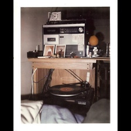

# Image Captioning

My implementation of image-captioning using PyTorch.

Developed & tested with Python 3.8, PyTorch 1.10.0 & CUDA 11.5 on a Windows 11 Laptop with an RTX 3060 GPU (ROG Zephyrus G14).

### Requirements
1) PyTorch
2) CUDA + CUDNN compatible with the PyTorch version installed
3) OpenCV, PyYAML, tensorboardX, tqdm
4) Java SDK 1.8.0 (to run COCO-Eval-Cap metric computations)
5) [PyCOCOTools for Windows](https://pypi.org/project/pycocotools-windows/) (if running on a Windows machine)
6) [MSCOCO train2014 and val2014 images + annotations](https://cocodataset.org/#download)

### Results

#### 1) ResNet50-LSTM
This model encodes the image into a 512-dim vector using a Resnet50 model and uses that as\
the hidden state for generating the first output token. The first input token is `</START>`.\
The model then generates the next token conditioned on its current hidden state(s) and input token\
until it generates the `</END>` token.

The model's inference function adds the `</START>` token to the output-list before appending its output tokens.

The model is trained with 'label forcing', i.e. it only sees the label tokens as its inputs during training.

This is an initial implementation with the following hyperparameters:\
300-dim embeddings (from-scratch), 512-dim LSTM layer, token-count cutoff of 10, 16 batch-size.\
Trained for 25 epochs/647k steps (19 epochs: Encoder frozen, 6 epochs: End-to-end Training)\
Time to train: 14.5 hours on my laptop

Cross-Entropy Loss, Adam Optimizer, No gradient clipping, Trained with Automatic Mixed-Precision\
Inference using greedy/max eval or using beam-search.

Performance metrics on MSCOCO val2014 captions set:

| Metric        | Beam-size 1 / Max  | Beam-size 3 | Beam-size 5 |
| ------------- |:--------------------:|:-------------------:|:-------------------:|
| Bleu_4        | 0.2523 | 0.2804 | 0.2796 |
| METEOR        | 0.2278 | 0.2337 | 0.2331 |
| ROUGE_L       | 0.5008 | 0.5080 | 0.5043 |
| CIDEr         | 0.7806 | 0.8165 | 0.8114 |
| Inference Speed (in fps) | 60 | 23 | 10  |

[Captioning results](checkpoints/c1_r50_lstm/caption_result) for greedy/max evaluation on images randomly sampled from MSCOCO val2014: 

 \
Generated caption:
`['</START>', 'a', 'woman', 'is', 'holding', 'a', 'wii', 'remote', 'in', 'her', 'hand', '.', '</END>']`\
Label caption:
`['</START>', 'a', 'beautiful', 'blonde', 'woman', 'in', 'tight', 'blue', 'jeans', '.', '</END>']`

It got the Wii Remote. Nice. 

 \
Generated caption:
`['</START>', 'two', 'women', 'standing', 'next', 'to', 'each', 'other', 'in', 'front', 'of', 'a', 'tree', '.', '</END>']`\
Label caption:
`['</START>', 'a', 'man', 'and', 'woman', 'are', 'hanging', 'out', 'at', 'a', 'park', '</END>']`

Umm, moving on.

 \
Generated caption:
`['</START>', 'a', 'kitchen', 'with', 'a', 'stove', 'and', 'a', 'microwave', '</END>']`\
Label caption:
`['</START>', 'a', 'picture', 'of', 'a', 'old', 'vinyl', 'player', 'and', 'tape', 'recorder', '.', '</END>']`

Dumb model!

 \
Generated caption:
`['</START>', 'a', 'herd', 'of', 'elephants', 'walking', 'across', 'a', 'dirt', 'field', '.', '</END>']`\
Label caption:
`['</START>', 'a', 'group', 'of', 'several', 'elephants', 'walk', 'through', 'the', 'mud', '</END>']`

Good job.

 \
Generated caption:
`['</START>', 'a', 'man', 'is', 'doing', 'a', 'trick', 'on', 'a', 'skateboard', '.', '</END>']`\
Label caption:
`['</START>', 'a', 'young', 'man', 'is', 'trying', 'to', 'pull', 'off', 'a', 'high', '</UNK>', 'skateboard', 'trick', '.', '</END>']`

Decent job. The name of the trick got cut-off in the label due to count threshold for the vocabulary.

#### 2) EfficientNetB4-LSTM with CrossEntropyLoss

| Metric        | Beam-size 1 / Max  | Beam-size 3 |
| ------------- |:--------------------:|:-------------------:|
| Bleu_4        | 0.2791 | 0.3069 |
| METEOR        | 0.2422 | 0.2498 |
| ROUGE_L       | 0.5207 | 0.5295 |
| CIDEr         | 0.8849 | 0.9249 |
| Inference Speed (in fps) | 33 | 17.5 |

#### 3) ResNet50-LSTM with Focal-Loss

| Metric        | Beam-size 1 / Max  | Beam-size 3 | Beam-size 5 |
| ------------- |:--------------------:|:-------------------:|:-------------------:|
| Bleu_4        | 0.2587 | 0.2822 | 0.2822 |
| METEOR        | 0.2329 | 0.2372 | 0.2356 |
| ROUGE_L       | 0.5044 | 0.5084 | 0.5047 |
| CIDEr         | 0.8072 | 0.8351 | 0.8311 |
| Inference Speed (in fps) | 60 | 23 | 10  |

#### 4) ResNeXT50-LSTM with Focal-Loss

| Metric        | Beam-size 1 / Max  | Beam-size 3 | Beam-size 5 |
| ------------- |:--------------------:|:-------------------:|:-------------------:|
| Bleu_4        | 0.2642 | 0.2853 | 0.2863 |
| METEOR        | 0.2369 | 0.2405 | 0.2392 |
| ROUGE_L       | 0.5092 | 0.5128 | 0.5097 |
| CIDEr         | 0.8312 | 0.8541 | 0.8501 |
| Inference Speed (in fps) | 60 | 23 | 10  |

#### 5) ResNeXT50-GRU with Focal-Loss

| Metric        | Beam-size 1 / Max  | Beam-size 3 | Beam-size 5 |
| ------------- |:--------------------:|:-------------------:|:-------------------:|
| Bleu_4        | 0.2641 | 0.2919 | 0.2952 |
| METEOR        | 0.2406 | 0.2451 | 0.2443 |
| ROUGE_L       | 0.5097 | 0.5168 | 0.5154 |
| CIDEr         | 0.8460 | 0.8890 | 0.8873 |
| Inference Speed (in fps) | 60 | 23 | 10  |

#### 6) ResNet50-LSTM with Attention & Focal-Loss

| Metric        | Beam-size 1 / Max  | Beam-size 3 |
| ------------- |:--------------------:|:-------------------:|
| Bleu_4        | 0.2677 | 0.2953 |
| METEOR        | 0.2370 | 0.2411 |
| ROUGE_L       | 0.5108 | 0.5163 |
| CIDEr         | 0.8338 | 0.8716 |
| Inference Speed (in fps) | 39 | 14 |

#### 7) ResNet50-LSTM with Attention-V2 & Focal-Loss
We send the 16-stride encoder output to the attention block and the global-pooled encoder output to a Fully-Connected layer to get the initial hidden state for the decoder.
| Metric        | Beam-size 1 / Max  | Beam-size 3 |
| ------------- |:--------------------:|:-------------------:|
| Bleu_4        | 0.2691 | 0.2943 |
| METEOR        | 0.2382 | 0.2428 |
| ROUGE_L       | 0.5129 | 0.5175 |
| CIDEr         | 0.8437 | 0.8751 |
| Inference Speed (in fps) | 37 | 14 |

#### 8) ResNet50-LSTM with Focal-Loss
Same performance as using randomly-initialized embeddings.
| Metric        | Beam-size 1 / Max  | Beam-size 3 | Beam-size 5 |
| ------------- |:--------------------:|:-------------------:|:-------------------:|
| Bleu_4        | 0.2582 | 0.2809 | 0.2788 |
| METEOR        | 0.2328 | 0.2360 | 0.2340 |
| ROUGE_L       | 0.5041 | 0.5056 | 0.5002 |
| CIDEr         | 0.8011 | 0.8292 | 0.8191 |
| Inference Speed (in fps) | 60 | 23 | 10  |

### References
1) Show and Tell Paper: https://arxiv.org/pdf/1609.06647.pdf
2) Andrej Karpathy's lecture on Image Captioning: https://youtu.be/yCC09vCHzF8?t=1876
2) Pycocoevalcap: https://github.com/Illuminati91/pycocoevalcap
3) Image Captioning Tutorial: https://github.com/yunjey/pytorch-tutorial/tree/master/tutorials/03-advanced/image_captioning
4) Image Captioning Repo: https://github.com/sauravraghuvanshi/Udacity-Computer-Vision-Nanodegree-Program/tree/master/project_2_image_captioning_project
