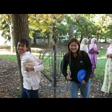

# Image Captioning

My implementation of image-captioning using PyTorch.

Developed & tested with Python 3.8, PyTorch 1.8.1 & CUDA 11.4 on a Windows 11 Laptop with an RTX 3060 GPU.

### Requirements
1) PyTorch
2) CUDA + CUDNN compatible with the PyTorch version installed
3) OpenCV, PyYAML, tensorboardX, tqdm
4) Java SDK 1.8.0 (to run COCO-Eval-Cap metric computations)
5) MSCOCO train2014 and val2014 images + annotations

### Results

#### 1) ResNet50-LSTM
This model encodes the image into a 512-dim vector using a Resnet50 model and uses that as\
the hidden state for generating the first output token. The first input token is `</START>`.\
The model then generates the next token conditioned on its current hidden state(s) and input token\
until it generates the `</END>` token.

The model is trained with 'label forcing', i.e. it only sees the label tokens as its inputs during training.

This is an initial implementation with the following hyperparameters:\
300-dim embeddings (from-scratch), 512-dim LSTM layer, token-count cutoff of 10, 16 batch-size.\
Trained for 25 epochs (19 epochs: Encoder frozen, 6 epochs: End-to-end Training)\
Cross-Entropy Loss, Adam Optimizer, No gradient clipping, Trained with Automatic Mixed-Precision\
Greedy evaluation (sampling the most probable token at every time-step)

Performance metrics on MSCOCO val2014 captions set:

| Metric        | Value  |
| ------------- |:------:|
| Bleu_4        | 0.2523 |
| METEOR        | 0.2278 |
| ROUGE_L       | 0.5008 |
| CIDEr         | 0.7806|

[Captioning results](checkpoints/c1_r50_lstm/caption_result): 

 \
Generated caption:
`['</START>', 'a', 'woman', 'is', 'holding', 'a', 'wii', 'remote', 'in', 'her', 'hand', '.', '</END>']`\
Label caption:
`['</START>', 'a', 'beautiful', 'blonde', 'woman', 'in', 'tight', 'blue', 'jeans', '.', '</END>']`

It got the Wii Remote. Nice. 

 \
Generated caption:
`['</START>', 'two', 'women', 'standing', 'next', 'to', 'each', 'other', 'in', 'front', 'of', 'a', 'tree', '.', '</END>']`\
Label caption:
`['</START>', 'a', 'man', 'and', 'woman', 'are', 'hanging', 'out', 'at', 'a', 'park', '</END>']`

Umm, moving on.

 \
Generated caption:
`['</START>', 'a', 'kitchen', 'with', 'a', 'stove', 'and', 'a', 'microwave', '</END>']`\
Label caption:
`['</START>', 'a', 'picture', 'of', 'a', 'old', 'vinyl', 'player', 'and', 'tape', 'recorder', '.', '</END>']`

Dumb model!

 \
Generated caption:
`['</START>', 'a', 'herd', 'of', 'elephants', 'walking', 'across', 'a', 'dirt', 'field', '.', '</END>']`\
Label caption:
`['</START>', 'a', 'group', 'of', 'several', 'elephants', 'walk', 'through', 'the', 'mud', '</END>']`

Good job.

 \
Generated caption:
`['</START>', 'a', 'man', 'is', 'doing', 'a', 'trick', 'on', 'a', 'skateboard', '.', '</END>']`\
Label caption:
`['</START>', 'a', 'young', 'man', 'is', 'trying', 'to', 'pull', 'off', 'a', 'high', '</UNK>', 'skateboard', 'trick', '.', '</END>']`

Decent job. The name of the trick got cut-off in the label due to count threshold for the vocabulary.

### References
1) Show and Tell Paper: https://arxiv.org/pdf/1609.06647.pdf
2) Andrej Karpathy's lecture on Image Captioning: https://youtu.be/yCC09vCHzF8?t=1876
2) Pycocoevalcap: https://github.com/Illuminati91/pycocoevalcap
3) Image Captioning Tutorial: https://github.com/yunjey/pytorch-tutorial/tree/master/tutorials/03-advanced/image_captioning
4) Image Captioning Repo: https://github.com/sauravraghuvanshi/Udacity-Computer-Vision-Nanodegree-Program/tree/master/project_2_image_captioning_project
